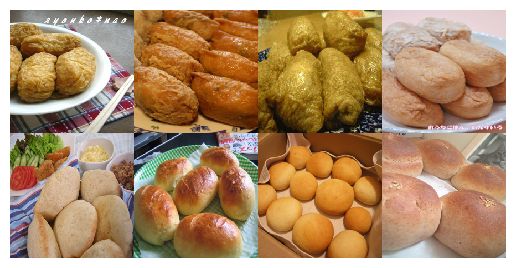

# sanushi
Sanushi coding task.

Description
-----------
The problem presented in this assignment is a very particular one, where we have to being able
to identify possible instances of sanushi class starting from a data set that contains two separate classes
for sushi and sandwich.

The way I want to solve the task is to build some model or representation that is able to identify
images that contain characteristics of both classes.

The first option I can think about is to build a classifier to solve the two class problem and then use its confidence
scores to identify possible sanushi where the classifier is "confused" and both classes are scored lower than a certain value. I think this solution may be valid,
but this way maybe will be difficult to reject other images from other classes that lead to a low confidence score for the sushi and sandwich classes.

I decided to use a different approach based on the Self Organizing Map (SOM), looking at this problem as a clustering problem,
in order to identify similarities between images and areas in the feature space where images from the two classes are very similar (close in the SOM space).
The SOM nodes corresponding to those areas can be eventually used to detect possible sanushi instances in a wider image collection.
Another advantage of using SOM is that node to sample distance can be tuned to reject images from other classes.

In this particular case, we used the SOM python library SUSI

https://susi.readthedocs.io/en/latest/index.html

This library is quite flexible and allows to use SOM for unsupervised, semi-supervised and supervised problems. For more
details about the implementation and basic SOM concepts you can refer to the SUSI paper

*F. M. Riese, S. Keller and S. Hinz, Supervised and Semi-Supervised Self-Organizing Maps for Regression and Classification Focusing on Hyperspectral Data, Remote Sensing, vol. 12, no. 1, 2020.*

More about the SOM can be found for example in

- *Kohonen, T. The self-organizing map. Proc. IEEE 1990*

- *Kohonen, T. Essentials of the self-organizing map. Neural Netw. 2013*

- *A Vesanto, Juha. Data exploration process based on the self-organizing map,2002*


How To run the code
--------------------
Clone the repository on your local machine

```
    git clone https://github.com/mc28-cc/sanushi.git
```
Install all the libraries required to run this program listed in the dependecies section.

run the code simply as

```
    python sanushi.py
```
The code has been kept intentionally simple with all the code in one script

If you want to avoid to re-calculate image features and fit the data to a SOM model 
please modify some flags in the main code as explained in the section above. See instrunctions below on how to download the pre-trained som
model

**Notes on Data structure**

Generated results or data (extracted features) are stored in subfolders of the path where sanushi is run.
In particular these folders are used/generated

- *sushi_or_sandwich* is the top folder containing raw dataset, it contains the two subfolders sushi and sandwich downloaded from the link provided with the assignment

- *datasetFeature* contains the VGG features used in this work and calculated for the entire dataset

- *modelSOM* contains the Self Organizing Map model used in this project to complete the sanushi task

- *resultsGraphs* contains all the results and figure discussed in this readme

Feature extraction is completed at the very beginning of the main function, the feature extracted are
then saved on disk (*datasetFeature* folder) so that can be reused constantly without needs of being recalculated.
Please not that a simple flag on the code *FeatExON* is used to activate/deactivate this part of the code.

Similarly it is possible to deactivate the SOM fitting to the data and avoid the SOM training. In this case it is possible to
load the model in the *modelSOM* folder by setting the flag *SomFitON* to false

**Note on Results and Data on GIT**

Folder *modelSOM* and *resultsGraphs* are replicated in *submittedModelSOM* and *submittedResultsGraphs* where all the results and models
used to discuss the assignment in this readme are saved. This way, in case you overwrite those folders you can use that specific
SOM and obtain exactly the results discussed below.

Even if it is not ideal to upload on the git repo the feature data, I think this is the best way
I can share with you properly the results obtained. However, SOM model results to be quite large (larger than github limit)
you can download it from this private gdrive link if you do not want to retrain the SOM

https://drive.google.com/open?id=1xS4m5iGDTLldBm_4IsrnC2PV5zwj069H

**Notes on Pictures**

Please be aware that the image collages included in this readme are generated building those
manually. If you re-run the software the SOM training may generate different results and the grid
size may not be valid anymore. To avoid this just set to 1 the parameter *ncols* in the function
**gallery**, you will end up with very elongated figures but the code will run end to end. If you use the 
pretrained model everything should be fine

Algorithm Summary
--------------------
The algorithm we propose is based on the Self Organizing Map (SOM) used as a method to perform unsupervised
clustering on the sushi/sandwich dataset.

A nice compact description of the SOM map can be found in the SuSI paper mentioned above:

*Self-organizing maps (SOMs) are a type of ANN that can handle datasets with few references.
SOMs are mostly used for unsupervised clustering and visualization......... It is a shallow
ANN architecture consisting of an input layer and a two-dimensional (2D) grid as the output layer.
The latter is fully connected to the input layer. The neurons on the output grid are interconnected to
each other through a neighborhood relationship. Changes on the weights of one output neuron also
affect the neurons in its neighborhood. This unique characteristic decreases overfitting of the training
datasets. Furthermore, the 2D output grid visualizes the results of the SOM comprehensibly. This plain
visualization does not exist in the majority of ANNs*

The SOM more interesting property for this application is the fact that the high dimensional feature space is projected in the SOM space and
that nodes that are close in the map are formed with data points that share somehow similar properties in the higher dimensional
feature space. This aspect will be important for us to understand how sushi and sandwhich images are distributed
around the SOM map, independently of the class label. Class labels will be used to analyze the cluster results and
identify in the SOM map areas characterized by nodes that are composed only from sushi/sandwich images and areas where node contains both type of images.
The latter areas can be seen as possible sanushi areas so that when a new test image is associated with a sanunshi SOM node it is considered as a sanushi image.

In summary, the idea is to use the SOM model to cluster the entire dataset (regardless of the image class), use the
class label once the SOM is trained to understand how the two classes are distributed and if there exist areas in the feature
space where sushi and sandwich share a certain degree of similarity. The nodes corresponding to those areas can be used to detect
sanushi instances in the future.

Schematically the algorithm is based on the following building blocks:

- Feature Extraction
- Unsupervised SOM clustering
- Cluster analyis and sanushi area identification


**Notes on Feature Extraction**

For this particular task I decided to use the VGG16 network to complete feature extraction block. This selection is based on the fact that VGG
and other similar deep architecture have been proved to be very powerful for object recognition. Moreover,
pre-trained networks have been also extensively used to extract deep features and successfully employed to tune more specific
classifiers for different applications.

We are not assuming that these are the best features for the sanushi task. We just pick this reasonable and very common choice
to work more on the main focus of the sanushi task, knowing that in a real scenario a more detailed feature analysis need to be completed

Reference to VGG *K. Simonyan, A. Zisserman Very Deep Convolutional Networks for Large-Scale Image Recognition
International Conference on Learning Representations, 2015*

Analysis Results
--------------------

The SOM model we trained is composed by a square grid with 15x15 Nodes.

The size of the SOM is critical for each application and may need to be tuned or adjusted according to the results.
In the literature there are different ways of selecting the SOM size. A typical rule of thumb is to use the total
number of nodes of 5*sqrt(N) where N is the number of data elements. This leads to a value of 11x11 square size in our case.
Other approach suggests to select the number of nodes such that around 5% is empty (SOM nodes can be empty), other
authors discussed the validity of this rules of thumb and propose an optimization for this value as in

*Andrii Shalaginov and Katrin Franke, A New Method for an Optimal SOM Size Determination in Neuro-Fuzzy for the Digital Forensics Applications,
IWANN, 2015*

I think that the optimization of the SOM size is beyond this task, and we select a value of 15x15 as a middle ground
value between the 5*sqrt(N) and number of empty cluster percentages.

Once the SOM is trained (see the pickled object in the download link) it is typical to inspect the so called U-Matrix
that contains distances between the nodes of the SOM. It is usually useful to identify specific patterns between the nodes
as similar nodes have a very small distance. However this UMAP does not show a clear cluster grouping, we have high distances
between clusters of the left of the map, while (especially on the right side of it)
there are areas with much smaller distances. We will see how this relate to the class distribution


Another interesting aspect is to evaluate how many sample per node have been allocated during training. This will also give us 
an idea of the empty nodes distribution. As it can be noticed, few clusters are characterized by high number of samples (around 20), these
clusters are mainly present in the right side of the map. Large areas of the SOM map seem characterized by few sample per node.


Now, we can quantify the different type of nodes according to the class of the images that compose those nodes.
In particular we mark in red the nodes where there is a majority of sushi images, with sky blue a set of nodes where 
there is a majority of sandwich images. Dark blue represents empty nodes while
pale pink represents nodes with an equal number of samples from the two classes. From the figure it is possible to see that
the SOM seems able to capture some data structure by separating in two macro-regions the map
with sushi-nodes and sandwich-nodes (note that sandwich node also generate a little island on the top left). Moreover, as it can be noticed this information is well
related to the UMAP presented before, where a large area of low distances between nodes span across the sandwich region.


Another interesting investigation around the SOM map is effectively to verify how many nodes contains only sushi images
and how many contain only sandwich images. This information is reported in the image below with dark green nodes representing sushi-only nodes,
sandwich nodes correspond to the orange cell, while dark red color is used for empty nodes and light green for
mixed nodes (containing at least one image of both classes). This shows that the SOM (more or less) is able to isolate two large regions 
of sushi-nodes (to left) and a region of sandwich node (bottom right) that are separated by an area composed by mixed
nodes. 


We will analyze more in detail the mixed nodes later, for now lets focus on the sushi-node and sandwich-node to understand what is the content
of this nodes. For example, we report in the figure below all the sushi images belonging to the largest sushi-node (that is in position 0,0 of the grid)
As it can be noticed the SOM effectively clustered together very very similar sushi plates with picture taken from above.


Similar results we get checking the largest sandwich node (position on the grid (12,11) ), where images of burgers,baguettes and large sandwiches on a plate are clustered togheter


Now we can explore the mixed nodes. We firstly explore the largest balanced node where there is a 50-50 split between
the two classes and then we explored the largest mixed node regardless of the class balance.
The images contained in the largest balanced cluster (position in the SOM grid (7,10)) are reported below, sushi images are on the first row
sandwich images are on the second one. As it can be noticed, in this case there is a huge confusion between the two classes, visually
the node seems to be grouping together dishes that contain leaves (or green components) and 'tomato-ish' ingredients. In this case
is interesting to see how the second item on the second row contains tomatoes symbols in the plate!


Similarly the images contained in the largest mixed node (see below) show a very particular case. It is a node composed by 23
images 19 sushi ones and 4 sandwich ones (SOM grid position 0,14). Please note that in order to have two balanced grids we split this example in two images.
As it can be noticed the sushi plates represented are very different from the others we saw before
they seem some sort of strange dumpling (not sure of its name as I am not an expert of Japanese dishes)
but this is clearly quite similar to bread photos in the sandwich classes reported as the last row in the second image




There is one last considerations to be made around mixed nodes, how can we use them to identify sanushi instances in the future?
Obviously balanced nodes must be considered as sanushi nodes.
 
 We can consider a very conservative detection system where only the latter ones are sanushi nodes and the all the rest of mixed nodes are converted to a sushi-sandwich
according to the dominant class present in that node. In this case, the label of new samples will be assigned following the dominant class plot reported above.
On the other extreme we can consider all the mixed nodes as sanushi ones and having a SOM map with the
characteristic of the class composition plot. In this case, the number of mixed nodes is quite large and obviously it could potentially
generate a lot of false sanushi detection. 
In both cases we can have issues: in the first case it is clear that the balanced nodes 50-50 are generated by chance during the training procedure (see random initialization of SOM), but we are not including, for example, the ones where the class balance is 51-49. 
In the second case we may consider as sanushi node a one with class composition ratio equal to
97(sushi)-3(sandwich). In this extreme case this node should be consider as a sushi one.

It is clear that a more reasonable value for this proportion must be identified. As an example, in the image below we consider as a possible sanushi node, a node where at least a quarter of the samples assigned to the node belongs to one class.
Again in this case we retain the Dominant Class color map: red for sushi, sky blue for sandwich, dark blue empty nodes, and pale pink for mixed nodes.


Summary and Possible Improvements
----------------------
Self Organizing Map has been employed to solve the sanushi task.
The idea is to use the SOM as a unsupervised approach on the entire dataset and identify as possible sanushi areas in the SOM
space those area where the SOM nodes have clustered together images from both classes. The main assumption is that a sanushi instance
is something that captures the visual appearance of both classes.
Results show that SOM based on VGG16 features is quite powerful with the ability to cluster together very similar
sushi and sandwich images in some of the full sushi/sandwich nodes. At the same time the sanushi nodes
seems reasonable as well where very similar images from both classes are mapped (see the dumpling example).
The approach seems reasonable, but its main weakness is a clear way to identify sanushi nodes, we explore the two different extremes, or a
more pragmatic and reasonable approach with a class balance of 75-25 required to identify sanushi nodes.

Possible improvements can be obtained with:

- Larger dataset, that may be able to help us to generate a more detailled SOM map,
especially the distance matrix seems a little less smoother than other examples reported in the literature

- SOM size optimization, maybe optimizing SOM size as the paper mentioned above can simplify the selection 
of sanushi nodes

- Different/optimized feature set

- Node to sample Distance: we did not use this metrics to eventually better define sanushi nodes. 

-------------
Packages required to run the sanushi code are listed in **requirements.txt**

Note that we use for the Self Organizing Map the python Susi Library (https://github.com/felixriese/susi), If it does not install
on your machine properly, please refer to https://susi.readthedocs.io/en/latest/install.html. I inserted all the requirements
for susi in the sanushi requirements.txt file for the sake of simplicity.

Note that I tested this on a window machine with miniconda3, in this case the Susi library does not have a conda
package and I downloaded and installed it manually (python setup.py install from the susi package), if you use pip it should work all fine
